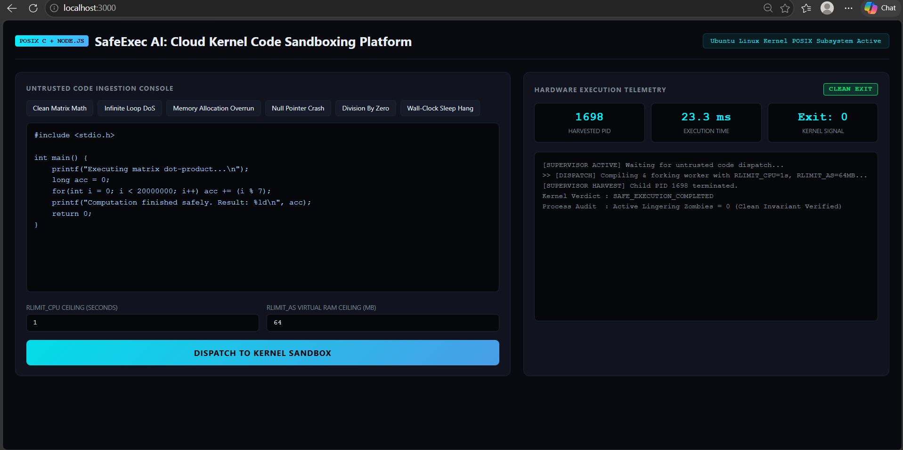
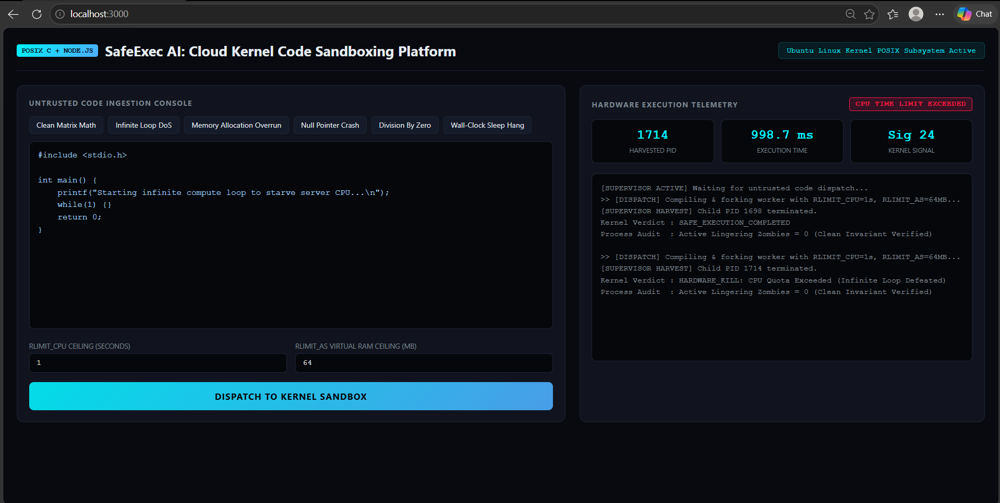
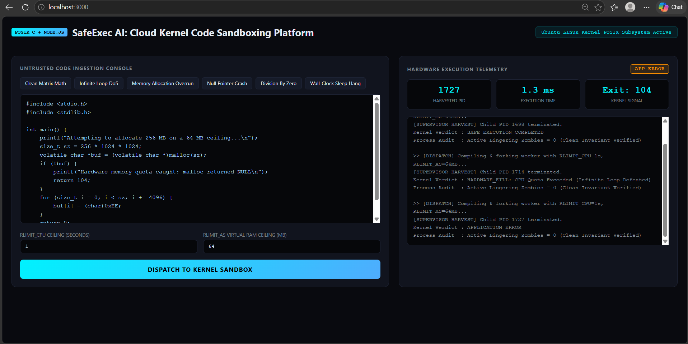
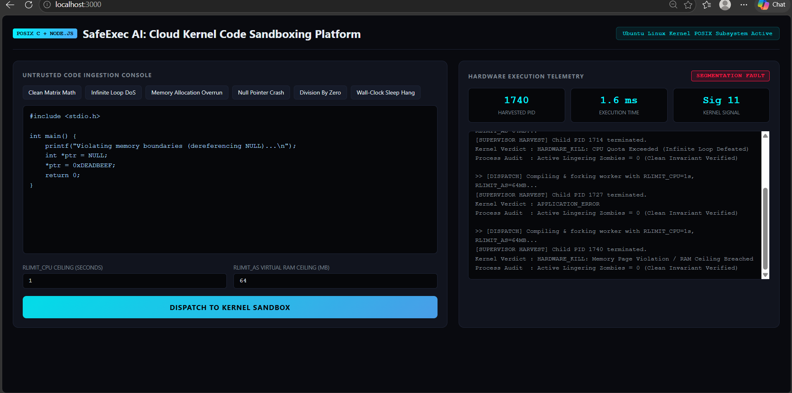
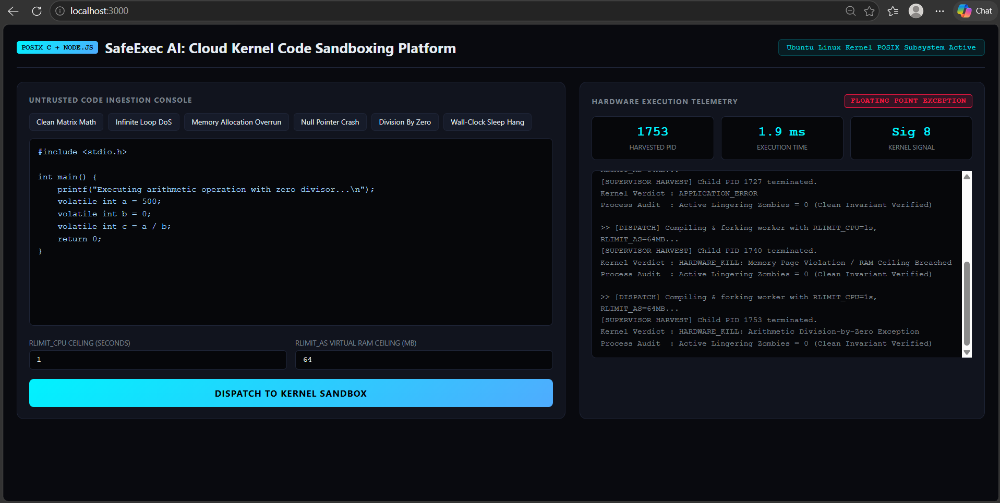
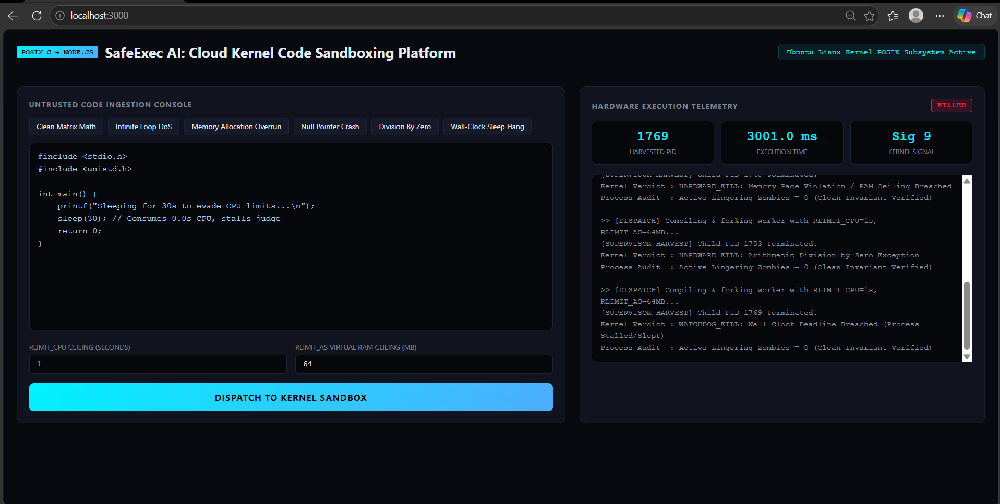

# Process Termination Message System (PTMS)

A Linux-based C system programming project that monitors child processes, decodes their termination statuses, and prevents zombie processes.

## Features
- Process creation using `fork()`.
- Process synchronization and status harvesting using `waitpid()`.
- Inspects termination status macros:
  - `WIFEXITED` & `WEXITSTATUS` for clean / exit-code terminations.
  - `WIFSIGNALED` & `WTERMSIG` for abnormal terminations (e.g., `SIGSEGV`).
- Prevents zombie process accumulation.

## Build & Run
```bash
make
./ptms
```

## SafeExec AI Screenshots

SafeExec AI runs untrusted C code in a kernel sandbox with CPU and RAM limits, then reports how the process terminated and confirms no zombie processes remain.

### Clean Exit (Exit 0)


### CPU Time Limit Exceeded (SIGXCPU, Sig 24)


### Memory Ceiling Enforced (malloc returns NULL, Exit 104)


### Segmentation Fault (SIGSEGV, Sig 11)


### Division by Zero (SIGFPE, Sig 8)


### Wall-Clock Watchdog Kill (SIGKILL, Sig 9)

